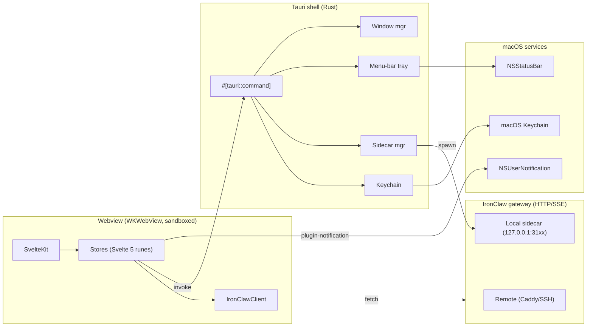
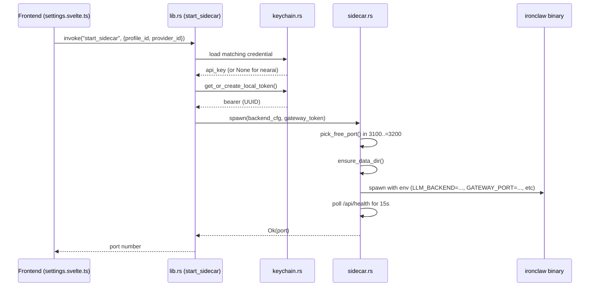
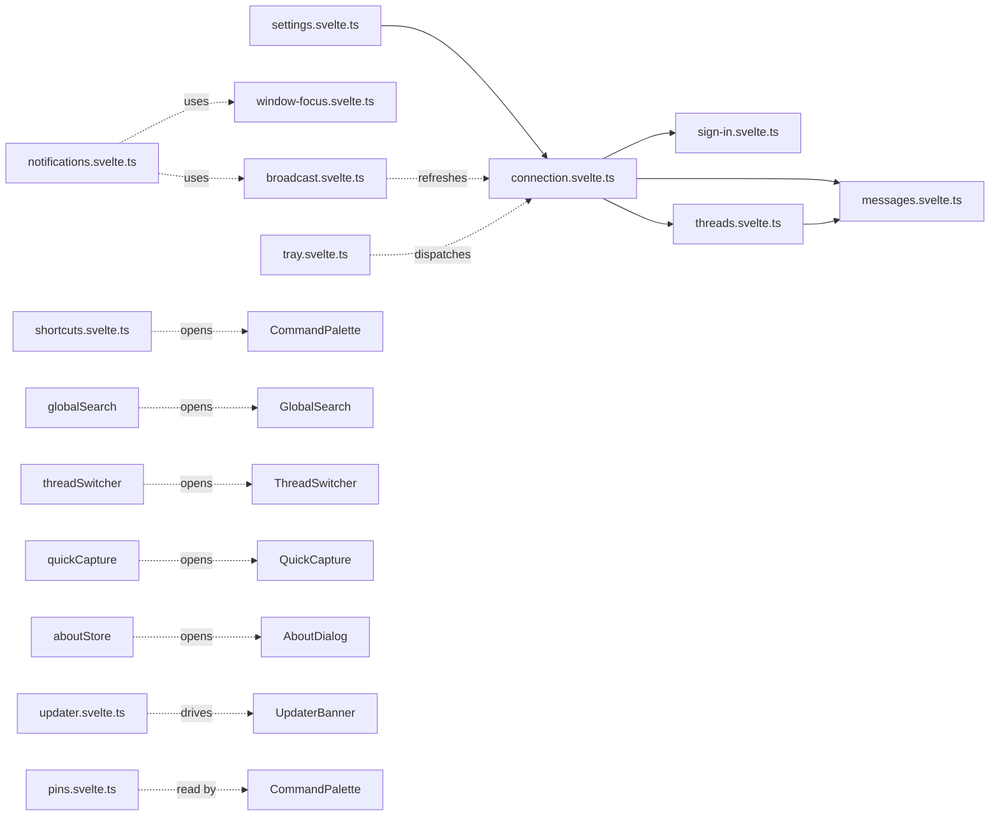
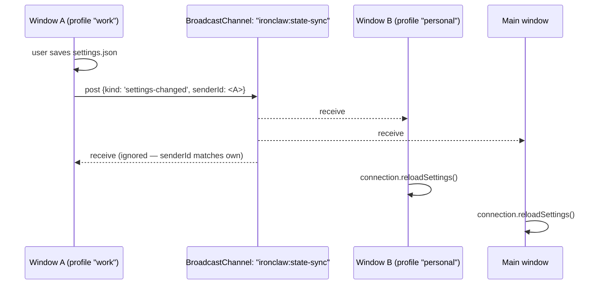

# Architecture

This document explains how the IronClaw Desktop client is wired together: the
Tauri shell on the Rust side, the SvelteKit frontend, the store layer, the
typed HTTP client to the gateway, multi-window state synchronization, the
bundled sidecar, and the CI / release pipeline.

If you only have time for the one-pager, read [Pitch](#pitch),
[Top-level shape](#top-level-shape), and [Security model](#security-model).
Everything else is reference.

---

## Pitch

IronClaw ships with a TUI and a web UI served by its own Rust gateway. Both
are great when you live on a server. They are not great when you live in
macOS: no Cmd+K, no Keychain, no native notifications, no menu-bar status,
no Cmd-Tab, no auto-update.

This app is the missing native shell. It does **two** things and nothing else:

1. Talks to an IronClaw gateway over HTTP — either a remote one (Caddy
   in front of a real install) or a bundled local sidecar started on
   demand.
2. Maps the gateway's capabilities (chat, knowledge, skills, routines,
   logs, jobs, missions, extensions, admin, settings) onto idiomatic
   macOS surfaces with first-class keyboard control.

The app intentionally has **no AI runtime of its own**. No bundled
inference, no MCP server registry of our own, no model catalog we
maintain. Every capability comes from the gateway. When the gateway
adds a feature, this app gets a new surface; when the gateway changes
a wire format, the typed client in `src/lib/api/ironclaw.ts` maps it.
This is the only way a two-person-evenings desktop client can stay
honest about a 200K-LoC Rust agent backend.

### Why Tauri + Svelte, not Electron

Three reasons, in order of weight:

- **Footprint.** The Tauri shell builds to a ~5 MB binary; the
  IronClaw sidecar bundled alongside is the dominant cost (~100 MB
  per-arch). An Electron equivalent would ship Chromium in addition.
  We are a thin client over a heavy server-side agent — we should not
  also drag a browser engine along for the ride.
- **Native conventions.** macOS title-bar overlays, native NSDialog
  file pickers, real Keychain (via the `keyring` crate), real
  NSUserNotificationCenter via `tauri-plugin-notification`, real
  `NSStatusBar` menu-bar tray via `tauri-plugin-tray`. Electron's
  equivalents are all best-effort wrappers; here they're a Rust call
  away.
- **Process model.** Tauri's IPC surface is a small set of typed
  commands. The webview cannot read arbitrary files, spawn arbitrary
  binaries, or touch the Keychain — every privileged operation passes
  through a `#[tauri::command]` we explicitly declared in `lib.rs`.
  That's the security model the app needs anyway; Tauri makes it free.

Svelte 5 (with runes) over React: state stores compile down to a few
function calls and `$state(...)` reads, no virtual DOM. The largest
single component in the tree (`CommandPalette.svelte`, 1.7K LoC, runs
a fuzzy search over six surface lists on every keystroke) holds 60 fps
on an M1 without memoization.

---

## Top-level shape

```
ironclaw-desktop/
├── src/                          # SvelteKit frontend (Svelte 5 runes + TS)
│   ├── routes/                   # one folder per surface
│   ├── lib/
│   │   ├── api/                  # typed HTTP client + Files plugin
│   │   ├── components/           # shared (palette, sidebar, statusbar, ...)
│   │   ├── stores/               # rune singletons (settings, threads, ...)
│   │   └── utils/                # redact, helpers
│   ├── app.css                   # tailwind + design tokens
│   └── hooks.client.ts           # SvelteKit error hook
├── src-tauri/                    # Rust backend
│   ├── src/
│   │   ├── main.rs               # entry — calls lib::run()
│   │   ├── lib.rs                # Tauri command surface, builder, plugins
│   │   ├── sidecar.rs            # spawn/monitor/stop bundled IronClaw
│   │   ├── keychain.rs           # macOS Keychain wrappers
│   │   ├── settings.rs           # opaque JSON settings persistence
│   │   ├── windows.rs            # multi-window (per-profile webviews)
│   │   └── tray.rs               # menu-bar status icon + menu
│   ├── capabilities/default.json # Tauri permissions allowlist
│   ├── binaries/                 # bundled IronClaw sidecar (gitignored)
│   ├── icons/                    # generated app + tray icons
│   └── tauri.conf.json
├── scripts/                      # bump-version, generate-updater-key, probe
└── .github/workflows/            # check, release, style-guard
```



---

## The Tauri shell (Rust)

`src-tauri/src/main.rs` is six lines — it calls `ironclaw_desktop_lib::run()`.
Everything is in `lib.rs` plus four sibling modules. Total: ~1500 lines of
Rust, including comments.

### `lib.rs` — command surface + plugin registration

Declares every `#[tauri::command]` the webview can call (the JS side talks
to all of them through `@tauri-apps/api/core`'s `invoke`). Groups, roughly
in the order they appear in the file:

- **Settings**: `get_settings`, `save_settings`. Round-trips an opaque
  `serde_json::Value` — JS owns the schema, Rust is just the I/O layer.
- **Gateway-token Keychain (per-profile)**: `get_token`, `set_token`,
  `delete_token`. Bearer token for a remote gateway, scoped per profile.
- **OpenRouter-key Keychain (per-profile)**: `get_openrouter_key`,
  `set_openrouter_key`, `delete_openrouter_key`. Legacy slot for the
  binary NEAR.AI/OpenRouter sidecar selector.
- **Per-provider LLM credentials**: `get_llm_provider_credential`,
  `set_llm_provider_credential`, `delete_llm_provider_credential`. The
  newer LlmProviderPicker stores each provider's key in its own slot
  (`llm-<provider>:<profile>`).
- **Local gateway token**: `get_or_create_local_token`. UUID generated
  on first run and cached in the Keychain — bearer for the bundled
  sidecar. Kept global (one bundled sidecar per install, regardless of
  profile count).
- **Sidecar lifecycle**: `start_sidecar`, `stop_sidecar`,
  `sidecar_status`. Takes a `BackendKind` or `provider_id`, gathers the
  matching credentials, and hands off to `sidecar::spawn`.
- **Data dir**: `local_data_dir` resolves AppData, `reveal_in_finder`
  shells `open -R <path>`. Used by the Settings page's "Show sidecar
  data" affordance.
- **Save / open dialogs**: `save_text_dialog`, `export_settings_dialog`,
  `open_text_dialog`. We deliberately do not expose
  `fs:allow-write-file` to the webview — the only path that ever crosses
  back to JS is the one the user picked in NSSavePanel.
- **Tray IPC**: `update_tray_status`, `set_tray_visible`,
  `update_tray_badge`, `show_main_window`.
- **Windows IPC**: `open_profile_window`, `list_open_profile_windows`
  (defined in `windows.rs`, registered here).

The `tauri::Builder` registers four plugins (`shell`, `dialog`,
`notification`, `updater`) and installs two event hooks:

- `on_window_event` for the `main` window's `CloseRequested`: prevent
  close, hide instead. This keeps the menu-bar tray alive after the user
  clicks the red traffic light. Quit goes through tray Quit or Cmd+Q.
- `app.run(...)` watches for `RunEvent::ExitRequested` and synchronously
  blocks on `sidecar::stop()` so we never leak a zombie child process.

`setup` builds the tray icon (best-effort — a missing tray is degraded
UX, not a launch failure) and honors the persisted `trayEnabled` flag.

### `sidecar.rs` — spawning the bundled IronClaw

The bundled IronClaw binary lives at `binaries/ironclaw-<target-triple>`.
`tauri-plugin-shell`'s `app.shell().sidecar("ironclaw")` resolves it
through `tauri.conf.json`'s `bundle.externalBin` entry. If the file is
missing (a `cargo run` against a checkout where `download.sh` was never
executed), the spawn returns a structured "rebuild via npm run tauri
build after running src-tauri/binaries/download.sh" error so the
frontend can show a useful message in the Settings page.

The spawn flow is:



Four LLM backend env blocks are wired (the others land as
"unsupported provider" errors at the IPC boundary so misconfiguration
surfaces loudly):

| Backend      | `LLM_BACKEND`       | Base URL                       | Key env                 |
| ------------ | ------------------- | ------------------------------ | ----------------------- |
| `nearai`     | `nearai`            | `https://private.near.ai`      | (none — IronClaw OAuth) |
| `openrouter` | `openai_compatible` | `https://openrouter.ai/api/v1` | `OPENROUTER_API_KEY`    |
| `openai`     | `openai`            | `https://api.openai.com/v1`    | `OPENAI_API_KEY`        |
| `anthropic`  | `anthropic`         | `https://api.anthropic.com`    | `ANTHROPIC_API_KEY`     |

Shared env: `GATEWAY_AUTH_TOKEN`, `GATEWAY_HOST=127.0.0.1`,
`GATEWAY_PORT=<picked>`, `DATABASE_BACKEND=libsql`, `AGENT_NAME=ironclaw`,
`GATEWAY_ENABLED=true`, `CLI_ENABLED=false`.

Stdout/stderr from the child are forwarded into the `log` crate at
`info`/`warn` so `RUST_LOG=ironclaw_sidecar=info npm run tauri dev`
shows the live gateway log inline. Secrets are never echoed — they only
ever pass through env vars.

Health-check: `wait_for_health` does a cheap TCP probe + a raw HTTP/1.0
`GET /api/health` (anything starting `HTTP/1.x` counts as alive, since
401 means the gateway is up but rejected the unauthed probe). 15s
timeout; on failure the child is killed and the error bubbles up to the
frontend toast.

### `keychain.rs` — macOS Keychain

Single `SERVICE = "com.openclaw.ironclaw-desktop"` namespace. Accounts:

- `gateway-token:<profile-id>` — remote gateway bearer
- `openrouter-key:<profile-id>` — legacy OpenRouter slot
- `llm-<provider-id>:<profile-id>` — per-provider credentials
- `local-gateway-token` — auto-generated UUID for the bundled sidecar
  (global, not per-profile)

Pre-Profiles installs had suffix-less accounts (`gateway-token`,
`openrouter-key`). `promote_legacy_if_needed` walks the legacy entry on
the first read of `:default`, copies it into the new slot, and clears
the legacy one. Idempotent — safe across reboots and across the
two profile-aware methods.

Sanitization: provider ids passed in from JS are filtered to
`[A-Za-z0-9_-]` before becoming an account string, so a hand-edited
settings.json can't smuggle in a colon and collide with the profile
suffix.

### `settings.rs` — opaque JSON persistence

50 lines. Round-trips `serde_json::Value` to/from
`$APPDATA/settings.json`. Rust does not parse the schema — the JS side
owns it (profiles, tints, toggles, etc.). On first run an empty object
is returned and the JS loader overlays defaults.

### `windows.rs` — multi-window (per-profile webviews)

Two commands: `open_profile_window(profile_id)` and
`list_open_profile_windows()`. Each window has a label
`profile-<sanitized-id>`; opening the same id twice focuses the
existing window rather than creating a duplicate. The window's URL
includes `?profile=<id>`, which the connection store reads on init
and uses to pin _this window_ to that profile without mutating the
persisted `activeProfileId`.

That subtle distinction is the entire point of multi-window: a "work"
profile and a "personal" profile can run side-by-side without
fighting each other.

Each Tauri webview is a separate WebKit process. They share the same
HTML/JS bundle from disk but get their own JS heap, their own store
instances, their own connection, their own sidecar (if local mode).
Cross-window state sync is the job of the BroadcastChannel-based
`broadcast` store — see [Multi-window](#multi-window).

### `tray.rs` — menu-bar status

Three icons embedded with `include_bytes!`: connected (green dot),
connecting (amber), disconnected (red). The JS connection store pushes
status changes through `update_tray_status`. Four-item menu:

- Show / Hide IronClaw — left-click on the tray icon also toggles
- Restart sidecar — emits a `tray:restart-sidecar` event for the JS
  side to handle
- Open Settings — emits `tray:show-settings`, focuses the main window
- Quit — uses `PredefinedMenuItem::quit`, which fires Tauri's normal
  exit path (so `sidecar::stop()` runs in `RunEvent::ExitRequested`)

Badge: `update_tray_badge(count)` renders the unseen-notification
count as text via `tray.set_title()` (option A from the design — no
image compositing). Numbers > 9 collapse to `"9+"`.

---

## The SvelteKit frontend

`svelte.config.js` uses the static adapter — there is no SSR, the whole
app is a SPA loaded into a Tauri webview. `+layout.ts` sets
`prerender = true` and `ssr = false`.

### Route layout

```
src/routes/
├── +layout.svelte      # the chrome (sidebar, status bar, lazy-mounted overlays)
├── +layout.ts          # ssr=false, prerender=true
├── +page.svelte        # / (Chat — the largest route)
├── +error.svelte       # last-resort render error
├── ChatSearch.svelte   # within-thread find (Cmd+F) — local to chat
├── SlashAutocomplete.svelte
├── onboarding/         # /onboarding (full-screen takeover; on completion → /dashboard)
├── dashboard/          # /dashboard — "Today": the home tile grid (Cmd+0)
├── desk/               # /desk — the Desk: proactive "Needs you" action inbox
├── streams/            # /streams — cross-surface activity feed
├── canvas/             # /canvas — spatial research board
├── knowledge/          # /knowledge — tree + FTS + DocViewer + import/new modals
├── memory/             # /memory — flat accumulated-memory card list
├── skills/             # /skills — list + filter + SkillDrawer; skills/ironhub — catalog browse/install
├── routines/           # /routines — list + DetailPanel + time formatting
├── jobs/               # /jobs — queue browser + JobDetailPanel
├── logs/               # /logs — live SSE tail with filter + grep
├── extensions/         # /extensions — ExtensionCard + SetupDrawer
├── missions/           # /missions — Engine v2 (gated by engineV2Enabled)
├── admin/              # /admin — System prompt, Tool policy, Usage dashboard (gated by adminMode)
├── mini/               # /mini — compact floating mini-mode panel (its own window)
├── dev/                # /dev/playground — dev-only component playground
└── settings/           # /settings — Profiles, LlmProviderPicker, etc
```

Sidebar nav, top to bottom: **Today → Desk → Streams → Chat → Canvas →
Knowledge → Memory → Skills → Routines → Jobs → Logs → Extensions →
Settings** — thirteen always-on surfaces, plus **Admin** (gated on
`adminMode`) and **Missions** (gated on `engineV2Enabled`) which appear above
Settings when their flags are set. Not in the sidebar: `/onboarding`
(first-run takeover), `/mini` (a separate floating window), `/dev/playground`
(dev-only), and `/skills/ironhub` (the catalog, reached from Skills). Chat
keeps `/` for deep-link compatibility; Today (`/dashboard`) is the named home
the app opens to after onboarding.

The shortcut map lives in `+layout.svelte` (`ROUTES_BY_DIGIT`):

| Chord | Route                                      |
| ----- | ------------------------------------------ |
| Cmd+0 | `/dashboard` (Today)                       |
| Cmd+1 | `/` (Chat)                                 |
| Cmd+2 | `/knowledge`                               |
| Cmd+M | `/memory`                                  |
| Cmd+3 | `/skills`                                  |
| Cmd+4 | `/routines`                                |
| Cmd+5 | `/jobs`                                    |
| Cmd+6 | `/logs`                                    |
| Cmd+7 | `/extensions`                              |
| Cmd+8 | `/admin` _(gated on `adminMode`)_          |
| Cmd+9 | `/missions` _(gated on `engineV2Enabled`)_ |
| Cmd+, | `/settings`                                |

Desk, Streams, and Canvas have no digit chord (0–9 are taken); they're
reached from the sidebar and command palette.

### Layout chrome

The root layout hosts eight cross-surface components that mount once
and live forever:

| Component        | Triggered by                             | Purpose                                                       |
| ---------------- | ---------------------------------------- | ------------------------------------------------------------- |
| `Sidebar`        | always (hidden during onboarding)        | nav rails + collapsed/expanded, badges, profile popover       |
| `StatusBar`      | always (hidden during onboarding), Cmd+/ | bottom 28px bar with gateway/profile/sidecar state            |
| `Toasts`         | always                                   | floating toast viewport                                       |
| `UpdaterBanner`  | non-idle updater state                   | thin top banner above sidebar+main split                      |
| `CommandPalette` | Cmd+K, `palette.openPalette()`           | fuzzy search across nav/threads/skills/routines/docs/actions  |
| `GlobalSearch`   | Cmd+Shift+F, `globalSearch.show()`       | cross-surface data search (knowledge/skills/routines/threads) |
| `ThreadSwitcher` | Cmd+T, `threadSwitcher.show()`           | jump-to-thread (recently selected, fuzzy)                     |
| `QuickCapture`   | Cmd+Shift+N, `quickCapture.show()`       | drop a thought into a "Quick captures" thread without nav     |
| `AboutDialog`    | `aboutStore.show()` (palette + Settings) | app + gateway + profile + sidecar + system info               |

The onboarding route (`/onboarding`) is a full-screen takeover — the
layout suppresses the sidebar, status bar, banner, palette, etc. when
the path starts with `/onboarding`. The Cmd+K, Cmd+T, Cmd+Shift+F,
Cmd+Shift+N stores still allow toggling there, but the modals don't
render so the wizard owns the screen.

### App-level effects

Two `$effect` blocks in `+layout.svelte` do app-wide bookkeeping:

- **Hide-on-disable guards.** If the user toggles `adminMode` or
  `engineV2Enabled` off while sitting on `/admin` or `/missions`, the
  effect bounces them to `/settings` so they don't see a stranded page.
- **Window focus → mark unseen seen.** When the OS window gains focus
  (Cmd-Tab, dock click, tray click), the notifications store calls
  `markAllSeen()` and pushes a fresh tray badge.

`onMount` boots in this order:

1. `windowFocus.init()`, `notifications.hydrate()`, `pins.init()`
2. `tray.init()` (wires the four tray-event listeners)
3. `broadcast.init()` (opens the cross-window BroadcastChannel)
4. `connection.init()` (loads settings, opens the gateway connection,
   first health check) — when it resolves, redirect to `/onboarding`
   if `onboardingComplete` is false
5. `updater.hydrate()` + maybe `updater.check({respectSkip: true})` if
   cadence != `'never'`

The global `keydown` listener handles every Cmd-combo shortcut and the
bare-digit route map. It's installed on `mount` and removed on the
cleanup return.

---

## The store layer

Every store is a Svelte 5 rune singleton living in `src/lib/stores/`.
The `.svelte.ts` suffix is required for the Svelte compiler to enable
runes (`$state`, `$derived`, `$effect`) inside a `.ts` file.



What each owns:

- **`settings`** (~895 LoC) — the on-disk schema: profiles array,
  active profile, tints, toggles. Owns the migration from flat
  pre-Profiles shape to `{ profiles[] }`. Persists via the Tauri
  IPC (`get_settings` / `save_settings`). Exports `getToken`,
  `setToken`, etc. as thin wrappers over the Keychain commands.
- **`connection`** (~465 LoC) — `IronClawClient` instance + status
  (`idle | connecting | connected | disconnected | error`). Pushes
  status into the tray via `update_tray_status`. Owns the 30s
  health-poll timer. Reads the per-window `?profile=<id>` query
  param on `init()` and uses it as `windowProfileOverride`. The
  `switchProfile(id)` method tears down the previous connection (and
  the local sidecar, if applicable) before reconnecting.
- **`sign-in`** (~150 LoC) — wraps `GET /api/profile`, exposes
  `status: 'unknown' | 'signed-in' | 'signed-out' | 'error'`. Auto-
  polls every 60s while the connection is up; restarts on
  `connection.status === 'connected'`.
- **`threads`** (~170 LoC) — `Thread[]` list + selected id + recent-
  thread MRU (top 10, persisted in localStorage under
  `ironclaw-thread-recent`, consumed by ThreadSwitcher's sort bias).
- **`messages`** (~370 LoC) — `Record<threadId, Message[]>` confirmed
  history + `Record<threadId, string>` streaming buffer +
  `Record<threadId, ToolInvocation[]>` tool calls. Handles the
  full-content-vs-true-delta heuristic in `appendStreamingChunk`,
  paginated lazy load on scroll-up, optimistic user message rows
  with retry-on-fail metadata.
- **`notifications`** (~647 LoC) — the desktop notification facade.
  Wraps `@tauri-apps/plugin-notification`, gates on a master toggle
  - per-category switches (chat / routine / sidecar / error), per-
    category sound choice (eight macOS system sounds), quiet-hours
    block with overnight-wrap support. Tracks unseen count, pushes
    tray badge via `update_tray_badge`, fires `markAllSeen` on window
    focus.
- **`pins`** (~208 LoC) — cross-surface pin store keyed by surface
  (`skill | routine | knowledge | thread | extension`). 20-per-
  surface cap; localStorage persistence. Consumed by the palette's
  cross-surface "Pinned" section.
- **`sign-in`** — see above.
- **`tray`** (~115 LoC) — listens for the three tray-event names
  (`tray:show-window`, `tray:show-settings`, `tray:restart-sidecar`)
  and dispatches: navigation (`goto('/settings')`), connection store
  restart, refresh-on-show.
- **`updater`** (~350 LoC) — wraps `@tauri-apps/plugin-updater`'s
  `check` + `downloadAndInstall`. Owns the cadence timer (`never`,
  `launch`, `launch+6h`, `launch+1h`), the skip-this-version
  localStorage flag, and the "last check at" timestamp.
- **`broadcast`** (~239 LoC) — see [Multi-window](#multi-window).
- **`palette`** (`shortcuts.svelte.ts`, 25 LoC), **`global-search`**
  (31 LoC), **`thread-switcher`** (29 LoC), **`quick-capture`**
  (34 LoC), **`about`** (26 LoC) — five identical visibility-toggle
  singletons. Same shape: `open` rune + `show/close/toggle`. Each
  modal mounts in the layout and reads its store's `open`.
- **`toasts`** (~48 LoC) — toast queue with 3.5s auto-dismiss.
- **`window-focus`** (~83 LoC) — reactive `focused: boolean`. Used
  by `notifications` to suppress alerts when the user is already
  looking at the app.

---

## The API client

`src/lib/api/ironclaw.ts` is the typed HTTP client. 3.5K lines, one
class (`IronClawClient`), every method on it is a thin wrapper around
`fetch` with two non-negotiable properties:

1. **Defensive parsing.** Every response is read as `unknown`, then
   each field is pulled with explicit null-coalesce and fallback. The
   gateway is a real Rust service evolving in parallel; a renamed
   field on the wire side must not crash the UI, it must surface a
   `?? undefined` and let the consumer render a placeholder.

   Example (`gatewayStatus`):

   ```ts
   const ws = res?.ws_connections ?? 0;
   const sse = res?.sse_connections ?? 0;
   return {
     // ...
     total_connections: res?.total_connections ?? ws + sse,
     uptime_seconds: res?.uptime_secs ?? res?.uptime_seconds
     // ...
   };
   ```

   The `uptime_secs ?? uptime_seconds` line is load-bearing — the
   gateway renamed the field mid-cycle. We accept both.

2. **Wire-shape transformation lives in one place.** The consumer
   sees a stable normalized type from `types.ts`. The mapping from
   the raw gateway shape happens inside the method that fetches it,
   not at the call site. `getHistory` is the canonical example:
   the gateway returns `{turns: [...]}`, the client expands each
   turn into a flat `[user, assistant]` `Message[]` pair, and the
   consumer sees a `Message[]`. The Round-7 critical-bug-fix list
   in `CHANGELOG.md` is the bag of regressions this pattern prevents
   from recurring.

### `*Raw` / redacted methods

The gateway's `/api/settings` endpoint embeds raw bearer tokens
inside the `mcp_servers` value on single-tenant owner installs.
The `/api/admin/system-prompt` endpoint may also contain pasted
secrets. Surfaces that _render_ these payloads use the default,
redacted methods:

- `getSettings()` — runs `redactJsonObject` over the response
- `getSystemPrompt()` — runs `redactSecrets` over the text

Surfaces that _edit_ these payloads (the system prompt editor, the
"Server-side card" in /settings) must call:

- `getSettingsRaw()` — unredacted, dangerous, surface MUST render
  through `MaskedValue` with an explicit "View raw" toggle
- `getSystemPromptRaw()` — unredacted, only the editor uses it

If a future contributor calls the redacted variant from the editor,
saving will overwrite the real secret with the dotted mask. The
pattern is: read raw, edit raw, save raw; read redacted only for
read-only display. The `MaskedValue` component reinforces this at
the render layer.

`src/lib/utils/redact.ts` is the redactor. Pure, dependency-free,
seven patterns: `Bearer \S+`, `sk-...`, `pk-...`, `api_key=...`,
JWTs (`eyJ...`), GitHub PATs (`ghp_...`), GitHub installation
tokens (`ghs_...`). Two exports beyond the redactors:

- `containsSecret(text)` — cheap `RegExp.test` over a non-global
  copy of each pattern. Used by the system-prompt editor to render
  a "secrets detected" banner without committing to render the
  redacted form.
- `redactJsonObject(value)` — recursive structural redactor;
  numbers/booleans/null pass through unchanged.

### Chat event normalization

The chat surface streams two different wire formats:

- **Legacy** (`streamEvents`, `/api/chat/events`) — server emits
  `event: response` with `type: "response"` and the FULL content
  per event (not incremental). The client maps it to
  `content_delta`; the messages-store heuristic handles
  full-clobber vs true-delta.
- **Responses API** (`streamResponse`, `/api/v1/responses` with
  `stream: true`) — proper OpenAI Responses-API SSE: `response.created`,
  `response.output_item.added`, `response.output_text.delta`,
  `response.function_call.arguments.delta`, `response.output_item.done`,
  `response.completed`, `response.failed`, `response.error`,
  `error`.

`normalizeEvent` handles the legacy path; `mapResponsesEvent`
handles the Responses-API path. Both produce the same `ChatEvent`
union from `types.ts`, so consumers (the chat surface, the
messages store) don't need to know which wire format produced the
event. Capability detection (`capabilityDetect()`) probes
`GET /api/v1/responses` once per client; if it 404s the surface
soft-falls-back to the legacy path. Per-user opt-out lives in
Settings → Advanced.

Drops on the floor (deliberate, both wire formats):

- `type: "thinking"` (progress chatter like "Calling LLM...")
- `type: "status"` (short pings like "Done")
- Responses-API control events that don't carry UI-relevant state

---

## Markdown rendering

`src/lib/components/MarkdownView.svelte` (~574 LoC) is the renderer
used by chat, knowledge previews, and routine result blocks. The
pipeline is:

```
markdown string → marked (GFM, breaks, tables) → DOMPurify → {@html} → DOM
                       ↑
                       renderer overrides:
                       - code: hljs (12 langs)
                       - heading: slug + anchor link
                       - blockquote: callout if [!NOTE|WARNING|...]
                       - link: target="_blank", rel="noopener noreferrer"
```

Twelve highlight.js languages registered explicitly (tree-shaken core
build, not the all-200 default that ships ~1 MB): `bash`, `typescript`,
`javascript`, `rust`, `python`, `json`, `markdown`, `yaml`, `sql`,
`ini` (covers TOML), `xml` (covers HTML), `css`. Plus aliases:
`shell` → `bash`, `console` → `bash`. Anything else lands as plain
text (no error, no fallback to JS highlighting).

A delegated copy-to-clipboard button is injected post-render onto
every `<pre>`. One click listener on the wrapper handles dispatch —
no per-block listener re-attachment on every streaming tick.

The component API is just `{ markdown: string }`. Every consumer
(chat bubble, knowledge doc, mission step) passes raw markdown; the
component owns the entire pipeline.

---

## Multi-window

Each `open_profile_window(profile_id)` call spawns a new
WebviewWindow with label `profile-<sanitized-id>` and URL
`/?profile=<id>`. macOS WebKit treats each window as a separate
process: separate JS heap, separate stores, separate fetch contexts.

This is great for isolation (a hung chat in one window doesn't drag
the other) and a problem for everything else (settings saved in one
window don't auto-propagate). Fix: `broadcast.svelte.ts`.

### BroadcastChannel-based sync



Five message kinds:

- `settings-changed` — fired by any `saveSettings` call. Receivers
  call `connection.reloadSettings()` (not full `refresh()` — a
  cosmetic change shouldn't churn the gateway connection in every
  window).
- `profile-switched` — reserved for future logic that wants to react
  to a profile pivot without re-reading the full settings blob;
  currently covered by `settings-changed`.
- `notification-seen` — fired when any window focuses. Receivers
  also call `markAllSeen()` so every window's unseen counter and
  tray badge clear together. The local `markAllSeen()` knows not to
  re-emit, breaking the would-be loop.
- `connection-event` and `sidecar-status` — reserved; receivers
  currently ignore them (each window owns its own gateway + sidecar).

Loop prevention: every message carries a `senderId` (a UUID minted
per window at module load); receivers short-circuit messages whose
`senderId` matches their own. Without that guard, calling
`markAllSeen()` in response to receiving `notification-seen` would
echo back and ping-pong forever.

`BroadcastChannel` is no-op'd cleanly when unavailable (jsdom tests,
older webviews — Tauri 2 ships WebKit ≥ 16.4 which has it, but the
test environment doesn't).

---

## Security model

The single-sentence version: **secrets live in the macOS Keychain
(gateway tokens fall back to an owner-only 0600 app-data file when a
Keychain prompt can't complete) and the Tauri capability allowlist is
the only path from webview to OS.**

The longer version, by surface:

### Bearer tokens / API keys

- **Storage.** macOS Keychain via the Rust `keyring` crate.
  Never in localStorage. Never in settings.json. Never in
  `sessionStorage`. The Settings export blob (`export_settings_dialog`)
  reads the raw settings.json off disk so the exported file is
  byte-identical to what the app uses internally — and because the
  Keychain entries are _not_ in settings.json, the export file
  contains no secrets. Safe to email or sync across machines.
- **Gateway-token fallback (load-bearing).** If a Keychain ACL prompt
  can't complete — a macOS deadlock that hung the app in v0.2.8 — the
  gateway token is written to an owner-only `chmod 0600` file at
  `app_data_dir/tokens/<account>.token`. The `get_token_source` command
  and `TokenSourceBadge` surface whether the live value came from
  `keychain`, `file`, or is `absent`. This fallback is still never in
  localStorage, settings.json, or the settings export. It is
  intentional and must not be removed.
- **Scoping.** Per-profile for `gateway-token` and
  `openrouter-key` and `llm-<provider>` slots. Global for
  `local-gateway-token` (one bundled sidecar per install,
  regardless of profile count).
- **Migration.** Legacy suffix-less Keychain entries are auto-
  promoted to `:default` on first read of the corresponding
  profile slot. Idempotent.

### Webview capabilities

`src-tauri/capabilities/default.json` is the allowlist. Notable
entries:

- `core:default`, `core:window:default`,
  `core:webview:allow-create-webview-window`, `core:app:default`
  — the standard Tauri 2 baseline.
- `updater:default`, `dialog:default`, `notification:default` —
  the three plugins we wire.
- `shell:allow-execute` and `shell:allow-kill` — both scoped to
  the `binaries/ironclaw` sidecar only. The webview cannot
  spawn or kill any other process.
- `shell:allow-open` — tightened to `https://**`,
  `http://127.0.0.1:*/`, and `http://localhost:*/`. The webview
  can open external HTTPS URLs (the sign-in flow opens
  `https://private.near.ai/...` in the user's default browser)
  and any localhost URL (useful for the gateway's own web UI
  if the user wants to peek). It cannot open arbitrary `http://`
  URLs, `file://` URLs, or custom URL schemes.

### Filesystem

The webview has **no** `fs:` permissions. Every file read or write
goes through a Rust command:

- `save_text_dialog`, `export_settings_dialog`, `open_text_dialog`
  — all show NSSavePanel / NSOpenPanel first; the only path that
  ever crosses back to JS is the one the user picked.
- `local_data_dir` returns the AppData path so the Settings page
  can render it, and `reveal_in_finder` shells `open -R` so the
  user can navigate there in Finder. Neither command lets the
  webview _read_ an arbitrary path.

### CSP

`tauri.conf.json` sets an explicit Content Security Policy:

```
default-src 'self' tauri:;
connect-src 'self' tauri: ipc: http://* https://*;
img-src    'self' data: blob: tauri: http://* https://*;
style-src  'self' 'unsafe-inline' tauri:;
script-src 'self' tauri:;
font-src   'self' data: tauri:;
media-src  'self' data: blob: tauri:;
frame-src  'none';
object-src 'none';
base-uri   'self';
```

Directive-by-directive rationale:

- `default-src 'self' tauri:` — fallback that allows only the
  bundled origin (`tauri://localhost`) and the `tauri:` scheme.
- `connect-src 'self' tauri: ipc: http://* https://*` — fetches
  and SSE streams. `http://*` and `https://*` are required because
  the user configures arbitrary gateway URLs (could be `127.0.0.1`,
  `abby`, or any remote host); `ipc:` is needed for Tauri IPC.
- `img-src 'self' data: blob: tauri: http://* https://*` — bundled
  assets, chat attachments rendered as `data:` URLs (R11b), and
  remote images served from a gateway response.
- `style-src 'self' 'unsafe-inline' tauri:` — Svelte 5 emits inline
  styles for scoped CSS; `'unsafe-inline'` is the standard accepted
  cost. The XSS guard is `script-src`, not `style-src`.
- `script-src 'self' tauri:` — bundled scripts only, no inline,
  no `eval`. This is the meaningful XSS mitigation.
- `font-src 'self' data: tauri:` — bundled fonts and any `data:`-
  embedded font.
- `media-src 'self' data: blob: tauri:` — bundled and inline media.
- `frame-src 'none'` — no iframes (the webview never embeds one).
- `object-src 'none'` — no Flash / plugins / `<object>` / `<embed>`.
- `base-uri 'self'` — blocks `<base>` tag redirection of relative
  URLs.

The notable looseness is `connect-src http://* https://*`: gateway
URLs are user-configurable at runtime, so we can't enumerate them.
Tightening it would require proxying every HTTP call through a
Rust command, which is a larger refactor. `style-src 'unsafe-inline'`
can be dropped once Svelte 5 grows nonce support.

### Redaction layer

See [The API client](#the-api-client) → "\*Raw / redacted methods".
Defense-in-depth for the day we render `mcp_servers` somewhere we
shouldn't.

---

## The bundled IronClaw sidecar

Pre-built `aarch64-apple-darwin` and `x86_64-apple-darwin` binaries
are downloaded out-of-band by `src-tauri/binaries/download.sh`
(they're ~100 MB each and `.gitignore`d). The `bundle.externalBin`
entry in `tauri.conf.json` references the unsuffixed `binaries/ironclaw`
and `binaries/sandbox_daemon`; Tauri picks the right per-target file
at bundle time using the target triple suffix.

`tauri-plugin-shell` is the plumbing. `app.shell().sidecar("ironclaw")`
returns a `Command` builder; we add env + args + cwd and call
`.spawn()`. The returned `(rx, child)` pair is split: `child` goes
into the `SidecarState` slot, `rx` feeds a `tokio::spawn` that
forwards stdout/stderr into the `log` crate.

The four LLM backend env blocks are described in the
[sidecar.rs section above](#sidecarrs--spawning-the-bundled-ironclaw).
New providers add a `BackendConfig` variant in `sidecar.rs` and a
match arm in `start_sidecar`'s provider dispatcher in `lib.rs`. The
JS side wires the credential storage via the
`set_llm_provider_credential` command.

Lifecycle:

- App start: nothing happens. The sidecar is opt-in (the user picks
  `local` mode for a profile and clicks Connect).
- User clicks Connect: `start_sidecar(profile_id, provider_id)`,
  Rust resolves credentials, picks a port (3100–3200), spawns the
  child, polls `/api/health` for up to 15s.
- User clicks Disconnect: `stop_sidecar()` → `kill()`. Idempotent.
- User profile-switches (settings store fires the change): the
  connection store tears down the previous sidecar via
  `stop_sidecar()` before re-spawning with the new profile's
  credentials.
- App quits: `RunEvent::ExitRequested` synchronously blocks on
  `sidecar::stop()` so we never leak a zombie.

---

## CI / release

Three workflows in `.github/workflows/`.

### `check.yml` — PR + push-to-main gate

Two jobs, both on `macos-14`:

- **frontend**: `npm ci`, `npm run check` (svelte-check +
  TypeScript), `npm run test` (vitest), `npm run build` (vite).
  This is the primary green-light gate.
- **rust**: `cargo check`, `cargo clippy -- -D warnings`. Clippy
  is `continue-on-error: true` until the existing warnings are
  cleared; check is the hard gate.

Neither job runs `tauri build` because the sidecar binaries are
gitignored and downloading them on every check would burn an hour
of CI minutes per PR. The release workflow does the full bundle.

### `release.yml` — tag-triggered build

Triggered by `push: tags: 'v*'` (or manually via
`workflow_dispatch`). One job on `macos-14`:

- Install both target triples (`aarch64-apple-darwin`,
  `x86_64-apple-darwin`).
- Run `src-tauri/binaries/download.sh` to fetch the sidecar
  binaries.
- `npm ci`, then `npm run tauri build -- --target <arch>` for both
  arches. `TAURI_SIGNING_PRIVATE_KEY` + `_PASSWORD` are pulled
  from GitHub Actions secrets when present — when they're set,
  the updater artifacts are signed and `.app.tar.gz.sig` files
  are produced. When they're unset, the build still succeeds; the
  artifacts are just unsigned and auto-update verification will
  fail until signing is wired.
- Collect `.dmg`, `.app.tar.gz`, `.app.tar.gz.sig` into
  `release-artifacts/`.
- `softprops/action-gh-release@v2` creates a GitHub release with
  auto-generated notes from commits since the last tag.

### `style-guard.yml` — color allowlist

A grep over `src/` and `src-tauri/` for the four hardcoded accent
hex values (`#00d4ff`, `#4ca7e6`, `#2882c8`, `#00bcd4`). Allowlist:
`tailwind.config.js`, `src/app.css`, `src-tauri/icons/`, the
`build_icons.py` generator. Any hit outside the allowlist fails the
PR with a "use the accent-cyan / accent-signal classes or the
`--v2-accent` CSS var" message. This protects the per-profile tint
override mechanism — if a component hard-codes the cyan, the tint
silently doesn't apply to that surface.

---

## Pointers

- Adding a new top-level surface: [CONTRIBUTING.md → Adding a new surface](CONTRIBUTING.md#adding-a-new-surface)
- Adding a new icon: [CONTRIBUTING.md → Adding a new icon](CONTRIBUTING.md#adding-a-new-icon)
- Adding a new API client method: [CONTRIBUTING.md → Extending the API client](CONTRIBUTING.md#extending-the-api-client)
- Adding a new LLM provider env block: edit `BackendConfig` in
  `src-tauri/src/sidecar.rs` + the provider dispatcher in
  `src-tauri/src/lib.rs`'s `start_sidecar` + the picker UI in
  `src/routes/settings/LlmProviderPicker.svelte`
- Cutting a release: [README → Cutting a release](README.md#cutting-a-release)
- Probing for newly-landed gateway endpoints:
  `bash scripts/probe-blocked-endpoints.sh`
