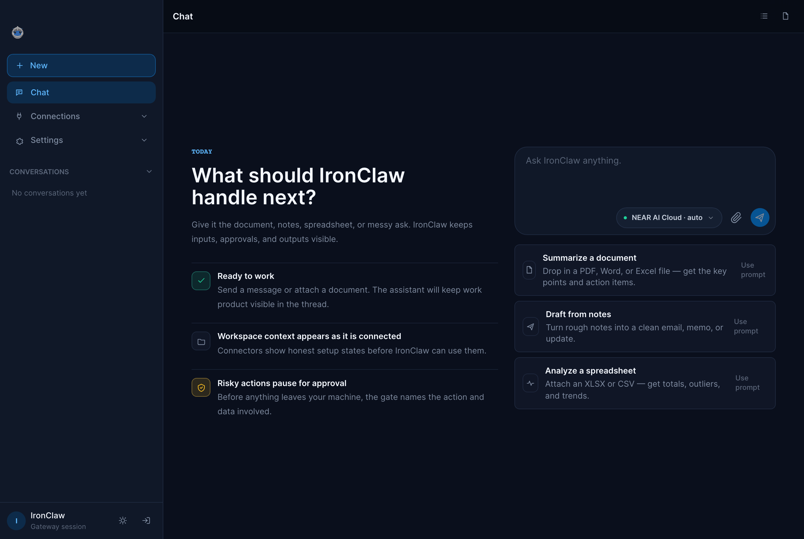
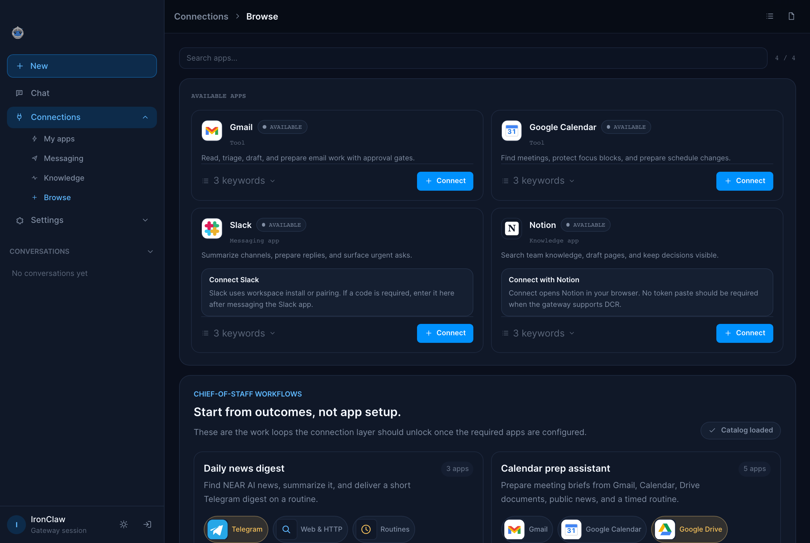
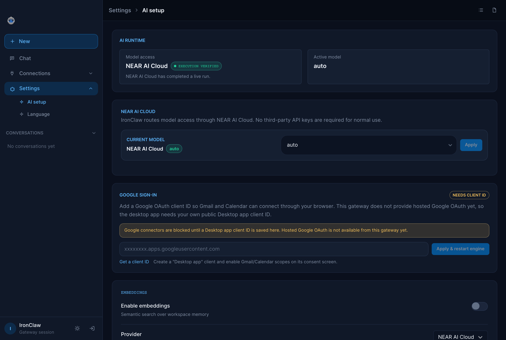
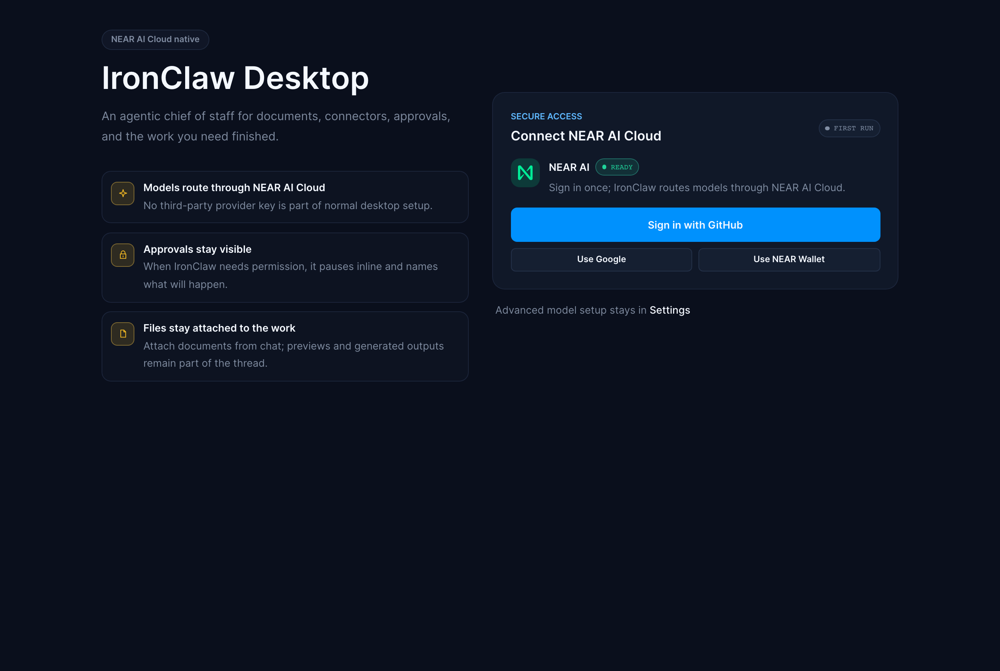

# IronClaw Desktop

[](https://github.com/nearai/ironclaw-desktop-app/releases/latest)

A native macOS client for [IronClaw](https://github.com/nearai/ironclaw) — the Rust knowledge agent from NEAR AI. Tauri v2 shell, packaging the Reborn static WebUI from `crates/ironclaw_webui_v2_static/static`. Dark, fast, ~5MB binary footprint (excluding bundled sidecar).

## Download

Latest macOS DMG: https://github.com/nearai/ironclaw-desktop-app/releases/latest

CI produces a universal macOS build that runs on Apple Silicon and Intel. Public release CI is wired for Developer ID signing and notarization once the Apple secrets in [`docs/RELEASE-SIGNING.md`](docs/RELEASE-SIGNING.md) are provisioned; local development builds remain unsigned-by-Apple.

## Why

IronClaw ships with a TUI and a web UI served by its own gateway. This app gives it a polished native shell with macOS conventions: Keychain-backed credentials, native notifications, menu-bar status, and sidecar lifecycle managed for you.

## 5-minute dev bring-up

If you want the app to actually sign in, start the bundled sidecar, and behave
like the desktop product, run the Tauri app:

```bash
npm install
npm run tauri dev
```

Do not use a bare browser tab as proof that auth works. `npm run
dev:webui-static` serves only the shared static WebUI for UI preview and smoke
tests; it does not spawn the desktop sidecar or provide the native auth bridge.
If you open a URL such as `http://127.0.0.1:<port>/v2/welcome` directly in a
browser without a gateway behind it, the NEAR AI Cloud sign-in buttons are
expected to stay disabled.

If you've cloned the repo and have a remote gateway reachable over an SSH alias:

```bash
bash scripts/dev-up.sh
```

That single command:

1. Opens the SSH tunnel to the remote gateway (idempotent, skips if already up).
2. Verifies the gateway responds.
3. Stages your bearer token into the file-fallback slot the Rust side falls back to when the macOS keychain ACL prompt hangs (see [v0.2.8 fix](CHANGELOG.md)).
4. Builds the frontend and the Rust binary, ad-hoc-signs the bundle.
5. Launches the app with `RUST_LOG=info` captured to `/tmp/ironclaw_dev.log` and surfaces the first ~10s of `ironclaw_diag` events so you can see the token load + first fetches.

Useful flags:

```bash
bash scripts/dev-up.sh --skip-build         # just re-launch the existing bundle
bash scripts/dev-up.sh --no-tunnel          # use a custom IRONCLAW_GATEWAY_URL
bash scripts/dev-up.sh --profile alt-svr    # bring up a non-default profile

IRONCLAW_TUNNEL_HOST=my-prod-box \
IRONCLAW_TUNNEL_PORT=23456 \
  bash scripts/dev-up.sh                    # point at a different remote
```

If the file-fallback ever stops feeling clean (handing the machine off, sharing the bundle, etc.), wipe it:

```bash
bash scripts/clear-token.sh default         # one profile
bash scripts/clear-token.sh --all           # nuke every file-fallback
```

For the keychain entry itself, use the `security` CLI:

```bash
security delete-generic-password \
  -s com.openclaw.ironclaw-desktop \
  -a 'gateway-token:default'
```

## Quick Tour

IronClaw Desktop is the native shell for the shared Reborn WebUI. The normal
product path is simple: connect NEAR AI Cloud, start from Chat, attach the work,
and let Connections/Settings stay honest about what is actually ready.

The shipped app exposes three top-level surfaces in the sidebar:

- **Chat** — the home surface for asks, files, approvals, and generated work product. Markdown rendering, code-block copy, PDF/Office/text attachments, OCR for scanned PDFs, and retry on failure are built in.
- **Connections** — inspect, install, configure, and honestly block workspace apps such as Gmail, Google Calendar, Notion, Slack, MCP servers, and channel integrations.
- **Settings** — per-profile gateway config, Keychain-backed tokens, NEAR AI Cloud model selection, language.

App-wide controls:

- **Cmd+,** — Settings (macOS convention).
- The **menu-bar tray** gives you Show/Hide, Restart sidecar, Open Settings, and Quit even when the window is hidden.

### What changed in the latest shipped pass

- Home screen is always the **Chat** surface; setup no longer traps users in configuration screens by default.
- **NEAR AI Cloud** is the normal desktop model path with one-click continuity from onboarding into chat.
- First-run onboarding no longer exposes generic provider or API-key setup; advanced model setup stays in Settings.
- **Model management** is now a focused NEAR AI Cloud workflow in **Settings → Inference** to keep chat execution clear and fast.
- **Extension setup** uses safer lifecycle calls (`install`, `activate`, `configure`) with honest state on failure.
- File attach + work-product export now routes through durable thread/message persistence so exports and outputs can be re-opened reliably.

### Current Screenshots








For the wiring underneath all this, see [`ARCHITECTURE.md`](ARCHITECTURE.md). For how to contribute a change, see [`CONTRIBUTING.md`](CONTRIBUTING.md).

The shipped desktop UI is the static Reborn WebUI under
`crates/ironclaw_webui_v2_static/static`, not the legacy SvelteKit tree under
`src/`. See [`docs/STATIC_WEBUI_SYNC.md`](docs/STATIC_WEBUI_SYNC.md) before
syncing with Reborn or claiming a Svelte test proves packaged-app behavior.

Third-party licenses: see [`THIRD_PARTY_LICENSES.md`](THIRD_PARTY_LICENSES.md).

## Workflows

The flows below cover the main ways people use the app. Pick the one that matches your setup.

### First-run setup

On first launch, onboarding asks one thing: **connect NEAR AI Cloud.** Sign in once and you land on the **Chat** surface — the app's home. Normal desktop use does not require third-party model-provider keys.



- **GitHub / Google** — browser sign-in for NEAR AI Cloud.
- **NEAR Wallet** — wallet-based continuity when enabled by the gateway.
- **Advanced setup** — key-based or managed-environment fallback configuration lives in **Settings**, not first-run onboarding.

OAuth-based sign-ins open in your system browser, not an embedded webview. Tokens are stored in the macOS Keychain (with an owner-only `chmod 0600` file fallback if a Keychain prompt can't complete), and are never written into `settings.json` or your exports.

Once NEAR AI Cloud is connected, Chat is ready -- ask anything, or drop in a document that needs work:


Choose the active NEAR AI Cloud model in **Settings -> Inference**:


### Connecting to a remote IronClaw gateway (advanced)

By default the app runs the bundled local sidecar. To instead point a profile at an IronClaw gateway running on a server you control (a VPS, a baremetal box, a teammate's machine), forward its loopback port over SSH and set the profile's Base URL + token.

1. **Forward the gateway port.** IronClaw binds to `127.0.0.1` on the server, so you need a tunnel. The bundled helper handles it (see [SSH tunnel helper](#ssh-tunnel-helper) below):

   ```bash
   bash scripts/tunnel.sh open       # opens the default tunnel to your configured gateway host
   ```

   Or roll your own:

   ```bash
   ssh -L 18789:127.0.0.1:3100 user@your-server
   ```

2. **Set the profile's Base URL** to the local end of the tunnel and paste your gateway token. The same Keychain storage and `settings.json`/export exclusions described above apply, so you only paste once per profile.

### Switching profiles

For users with multiple IronClaw instances (e.g. work + personal, prod + staging).

- The **sidebar profile chip** opens a picker. Each profile has its own connection settings, its own Keychain entry, and its own active thread/draft state.
- **Cmd+click any profile** in the picker to open it in a new window -- both windows poll independently, both show separate tray status, and tokens stay scoped to the profile they were entered for.
- **New profile**: sidebar chip -> "+ New profile". The dialog asks for name, mode (Local/Remote), URL, and token.

### Chat with attachments

Chat is the primary surface. Beyond plain conversation:

- **Attachments** — drop a file or PDF onto the composer. The app extracts text client-side and inlines it into the message so the model can read it. Scanned/image-only PDFs fall back to in-browser OCR (tesseract.js). OOXML Office formats (`.docx`, `.docm`, `.xlsx`, `.xlsm`, `.pptx`, `.pptm`), text, and CSV are supported; legacy binary Office files (`.doc`, `.xls`, `.ppt`) are rejected with a convert-and-reattach prompt instead of pretending the model can read them.
- **Markdown rendering** — responses render as markdown with syntax-highlighted, copyable code blocks.
- **Retry** — re-run the last turn on a failed or unsatisfying response.

## What's Inside

The shipped static WebUI exposes three sidebar surfaces:

- **Chat** (`/chat`) — the home surface. Streaming conversations with markdown rendering, code-block copy, retry on failure, and file/PDF/Office attachments with client-side text extraction + OCR.
- **Connections** (`/extensions`) — install, configure, and inspect workspace apps, MCP servers, and channel integrations.
- **Settings** (`/settings`, Cmd+,) — per-profile gateway config, Keychain-backed tokens, NEAR AI Cloud model selection, and language. Local sidecar lifecycle when running the bundled binary.

Plus, outside the sidebar:

- **Signed auto-updater** — releases ship signed `.app.tar.gz` + `.sig` artifacts; the in-app updater verifies the signature against the pubkey baked into the binary before installing. Public releases also require Developer ID signing and notarization; see [`docs/RELEASE-SIGNING.md`](docs/RELEASE-SIGNING.md).
- **Menu-bar tray** — Show/Hide, Restart sidecar, Open Settings, Quit, even when the window is hidden.

### Planned / not yet shipped

The route table registers several additional surfaces that are **hidden from
navigation** in the shipped app because their page-level API libs are still
stubs against gateway endpoints that haven't landed. They are not part of the
shipped experience and are documented here only so contributors aren't
surprised to find them in the source:

- **Workspace**, **Projects**, **Jobs**, **Routines**, **Missions** — hidden under the "Work" section.
- **Admin** — hidden under the "System" section.

These carry `hidden: true` in
`crates/ironclaw_webui_v2_static/static/js/app/routes.js`. The flag is removed
per route once its `lib/*-api.js` calls real `/api/webchat/v2/*` endpoints.
Do not document them as available features.

## Connection modes

- **Remote** — point the app at any IronClaw gateway (Caddy-fronted prod, SSH tunnel, etc.)
- **Local** — spawn the bundled IronClaw binary as a sidecar. NEAR AI Cloud is the default desktop model path; generic provider plumbing is intentionally hidden from the normal product surface.

## Prerequisites

- macOS 12+ (Apple Silicon or Intel)
- Node 22+
- Rust 1.80+
- Xcode Command Line Tools: `xcode-select --install`

## Develop

```bash
npm install
npm run tauri dev
```

First compile takes ~3 min (pulls Tauri, plugin-shell, plugin-updater, plugin-notification, keyring, uuid). Subsequent runs are cached.

Logging is wired through `env_logger`. The default filter is `ironclaw_desktop_lib=info,warn` — info-level for our crate, warn for everything else. Override at runtime with `RUST_LOG`:

```bash
RUST_LOG=debug npm run tauri dev                          # verbose everywhere
RUST_LOG=ironclaw_desktop_lib=trace,tauri=debug npm run tauri dev   # finer-grained
```

Targets used in our code: `ironclaw_tray`, `ironclaw_sidecar`, `ironclaw_keychain`. The keychain target logs slot names only — never the underlying secret.

## Pre-commit hooks

`simple-git-hooks` runs `prettier --check` on changed files before commit (via `lint-staged` — see the `lint-staged` block in `package.json`). Pre-push runs the full `npm run check` + `npm run test` suite, which mirrors what CI runs in `.github/workflows/check.yml`.

Hooks auto-install on fresh clones: `npm install` triggers the `prepare` script, which runs `simple-git-hooks` and wires `.git/hooks/pre-commit` and `.git/hooks/pre-push`.

To bypass a hook in a one-off (don't make a habit of this), prefix with `SKIP_SIMPLE_GIT_HOOKS=1`. For Rust formatting, run `cargo fmt --manifest-path src-tauri/Cargo.toml` manually — it's deliberately not in the JS hook to keep toolchains separate.

The codebase has NOT been mass-formatted; prettier only touches files as you change them. Don't run `npx prettier --write .` unless you intend a separate, isolated reformat commit.

## Build

```bash
# Unsigned .app + .dmg for the current Mac
npm run tauri build

# Output: src-tauri/target/release/bundle/{macos,dmg}/
```

Local builds automatically skip updater artifacts when `TAURI_SIGNING_PRIVATE_KEY`
is not set. Release builds that provide the key still generate the signed
`.app.tar.gz` updater payload.

To exercise the public-release universal target locally, first ensure all three
sidecars exist for both macOS arches, then prepare the universal externalBin
files Tauri expects:

```bash
bash src-tauri/binaries/download.sh
IRONCLAW_REPO_DIR=/path/to/nearai/ironclaw npm run build:reborn-sidecars
npm run prepare:universal-sidecars
npm run tauri build -- --target universal-apple-darwin
```

## Static checks

```bash
npm run check    # svelte-check + TypeScript
npm run verify:static-frontend
npm run smoke:webui-static # deterministic rendered UI smoke; does not prove live OAuth
npm run test:e2e # default rendered static WebUI smoke
npm run build    # vite frontend build (no Tauri compile)
cargo check --manifest-path src-tauri/Cargo.toml
```

### Accessibility

`tests/e2e/a11y.spec.ts` is an automated axe-core sweep that visits every
top-level surface (`/dashboard`, `/desk`, `/streams`, `/`, `/canvas`,
`/knowledge`, `/memory`, `/skills`, `/routines`, `/jobs`, `/logs`,
`/extensions`, `/admin`, `/settings`, `/missions`) and asserts the route has
no critical/serious axe violations. Heading-less workspaces (chat, the Desk,
the canvas) expose an `aria-label`'d region landmark on their root, which the
sweep waits on instead of an `<h1>`. Runs in CI on every PR
via `.github/workflows/e2e.yml` and locally via:

```bash
npm run test:e2e:legacy -- a11y.spec.ts
```

How to read the output:

- **Critical / serious** violations fail the build. If the spec reports
  one, the assertion message includes the offending element's selector
  and HTML snippet so you can locate it without re-running locally.
- **Moderate / minor** violations are logged with a
  `[a11y][<route>]` prefix but don't fail. Grep CI logs for that prefix
  to see the per-route count. Most of these are
  `aria-labelledby` / `aria-describedby` references that resolve at
  runtime but axe can't dereference in the headless DOM (the referenced
  element is in a portaled overlay that mounts on hover/focus).
- **`color-contrast`** is excluded from the suite. Manual review confirmed
  the navy/cyan/gold brand tokens meet WCAG AA; axe routinely false-flags
  tailwind opacity utilities because it can't model the underlying opaque
  background. See the spec header comment for the full rationale.

When adding a new route, append it to the `ROUTES` array in the spec and
extend the surface mock in `tests/e2e/_helpers.ts` (`mockGatewaySurfaces`)
with any new list/summary endpoints the route reads on mount.

## Local sidecar binaries

The bundled IronClaw binaries are downloaded out-of-band (they're large and gitignored):

```bash
bash src-tauri/binaries/download.sh
```

This fetches both `aarch64-apple-darwin` and `x86_64-apple-darwin` from the official IronClaw release.

## Project layout

```
ironclaw-desktop/
├── crates/ironclaw_webui_v2_static/static/
│   ├── index.html               # packaged Reborn static WebUI entry
│   ├── js/                      # shared static app source + generated bundle
│   ├── styles/                  # app.css + generated Tailwind CSS
│   └── vendor/                  # local browser libraries prepared for packaging
├── src/                         # legacy/reference SvelteKit shell, not packaged
├── src-tauri/                   # Rust backend
│   ├── src/
│   │   ├── lib.rs               # Tauri commands + plugin registration
│   │   ├── sidecar.rs           # spawn/stop bundled IronClaw
│   │   ├── keychain.rs          # macOS Keychain wrappers
│   │   └── settings.rs          # JSON settings persistence
│   ├── binaries/                # bundled IronClaw sidecar (gitignored)
│   ├── icons/                   # generated from icons/iconsrc.svg via build_icons.py
│   └── tauri.conf.json
└── .github/workflows/           # CI + release pipeline
```

## Releasing

### One-time setup (signing keypair)

1. Generate the updater signing key:

   ```bash
   bash scripts/generate-updater-key.sh
   ```

   The script writes the keypair to `~/.tauri/ironclaw-updater.key{,.pub}` and refuses to overwrite an existing key.

2. Confirm `src-tauri/tauri.conf.json` still contains the matching public key under `plugins.updater.pubkey`.

3. In the GitHub repo settings, add two Actions secrets:
   - `TAURI_SIGNING_PRIVATE_KEY` — contents of `~/.tauri/ironclaw-updater.key` (already base64-encoded by Tauri). Copy with `cat ~/.tauri/ironclaw-updater.key | pbcopy`.
   - `TAURI_SIGNING_PRIVATE_KEY_PASSWORD` — empty by default (the generator uses no password). If you re-run the generator with a password later, update this secret.

The public key is already committed. Release and local Tauri updater-artifact builds still need the private key secret (`TAURI_SIGNING_PRIVATE_KEY`) so the `.app.tar.gz` updater payload can be signed. Without it, `npm run tauri build` produces the unsigned `.app` and `.dmg` and skips updater artifacts.

Developer ID signing and notarization use a separate Apple certificate and App Store Connect API key. Provision those secrets from [`docs/RELEASE-SIGNING.md`](docs/RELEASE-SIGNING.md) before cutting a public release.

### Cutting a release

1. Run the release readiness preflight. It hard-fails if updater signing, Apple signing/notarization, or the three version files are not ready:

   ```bash
   bash scripts/check-release-readiness.sh --require-apple-signing
   ```

2. Bump the version across all three files at once:

   ```bash
   bash scripts/bump-version.sh 0.1.3
   ```

   This updates `package.json`, `src-tauri/tauri.conf.json`, and `src-tauri/Cargo.toml`. All three must agree.

3. Update `CHANGELOG.md` with what changed.

4. Commit + tag:

   ```bash
   git commit -am "v0.1.3"
   git tag v0.1.3
   git push && git push --tags
   ```

5. The `release` workflow (`.github/workflows/release.yml`) checks out the matching IronClaw Reborn source, builds the missing `ironclaw-reborn` sidecar slices, combines all sidecars for `universal-apple-darwin`, signs the updater artifacts when secrets are present, and creates a GitHub release with the universal `.dmg`, universal `.app.tar.gz`, `.app.tar.gz.sig`, and `latest.json` files attached.

6. The workflow generates `latest.json` with `scripts/build-updater-manifest.mjs`. The app polls `https://github.com/nearai/ironclaw-desktop-app/releases/latest/download/latest.json` on startup; if the updater signature is missing, manifest generation fails instead of publishing a broken update. For universal releases, both `darwin-aarch64` and `darwin-x86_64` entries point at the same universal updater archive.

### Sanity-checking a release locally before tagging

```bash
npm run tauri build
```

Produces unsigned `.app` + `.dmg` at `src-tauri/target/release/bundle/`. Mount the DMG, drag to Applications, right-click → Open (first launch only — Gatekeeper warns about unsigned apps).

### SSH tunnel helper

If your IronClaw runs on a remote host, the desktop client needs the
gateway port forwarded locally. The bundled helper handles open/close/
status for you:

```
bash scripts/tunnel.sh open       # opens default tunnel to your configured gateway host
bash scripts/tunnel.sh status     # reports state + gateway health
bash scripts/tunnel.sh close      # kills the tunnel
bash scripts/tunnel.sh restart    # close + open
```

Override defaults via env: `IRONCLAW_SSH_ALIAS` + `IRONCLAW_TUNNEL_PORT`.

### Probing server-blocked endpoints

Some desktop actions are pre-wired before the gateway exposes the matching
endpoint (thread delete, routine create, memory delete, etc.). A few of those
actions already appear in the UI and honestly toast the gateway error until the
server lands. To check whether any have landed upstream:

```bash
bash scripts/probe-blocked-endpoints.sh
```

Yellow ⚠ lines indicate the gateway started responding — time to wire UI.
The script reads your configured SSH alias (`IRONCLAW_SSH_ALIAS`) and resolves
the gateway token from the live IronClaw process env. Always exits 0 (it's a
discovery tool, not a CI gate).

## Bundle analysis

The static-adapter output lives at `build/_app/immutable/` after `npm run
build`. Four scripts under `scripts/` give you a zero-dep view of what
shipped:

```bash
# Walk the build, report per-file raw + gzip size, line count, top-5 largest.
# Writes /tmp/ironclaw-bundle-report.txt. Auto-runs `npm run build` if
# build/ is missing (force a rebuild with FORCE_BUILD=1).
bash scripts/analyze-bundle.sh

# Diff the current build against scripts/bundle-baseline.json. Exits 3 if
# total gzip grew >10% or any stable-path file grew >25%. Accept the new
# sizes with UPDATE_BASELINE=1.
bash scripts/bundle-compare.sh

# Spin up the legacy Vite app on :1420, probe a handful of routes for TTFB
# + total transfer time, count critical resources, kill the server. Writes
# /tmp/ironclaw-perf-snapshot.txt. Smoke test only — not Lighthouse.
bash scripts/perf-snapshot.sh
```

`scripts/bundle-baseline.json` is the committed reference for
`bundle-compare.sh`. Refresh it intentionally after a release lands a real
size change:

```bash
UPDATE_BASELINE=1 bash scripts/bundle-compare.sh
```

TODO: wire `bundle-compare.sh` into the PR workflow under
`.github/workflows/` so each PR posts a bundle diff comment against
`main`'s baseline. For v1 the scripts are local-only.

### Bundle size budget (CI-enforced)

`scripts/check-bundle-size.sh` enforces hard ceilings on the gzipped JS
shipped to users. It sums `build/_app/immutable/{entry,chunks,nodes}/*.js`
(CSS/fonts/images excluded — those rarely cause regressions) and compares
against `scripts/bundle-budget.json`:

```json
{
  "total_gzip_kb": 360,
  "entry_gzip_kb": 6,
  "largest_chunk_gzip_kb": 55
}
```

Exit codes: `0` under budget, `1` over (fails CI), `2` within 90% of budget
(warning — CI treats this as a soft signal, not a block). The check runs on
every PR via `.github/workflows/check.yml` after the static WebUI contract and
smoke gates.

To run locally:

```bash
bash scripts/check-bundle-size.sh             # builds first, then checks
SKIP_BUILD=1 bash scripts/check-bundle-size.sh   # use existing build/
```

**Bumping the budget intentionally.** When a feature legitimately needs the
size (new vendor dep, new route bundle, etc.) and the bump survives a
`bundle-compare.sh` sanity check, edit `scripts/bundle-budget.json` in the
same PR that adds the dep. Convention: leave ~10% headroom above the new
actuals so the next minor change doesn't immediately re-trip the gate. Keep
the bump justified in the commit message so future reviewers can sanity-check
the trade-off (a fat dep that landed for one feature is the kind of thing
that should get noticed twice).

If a bump is _not_ intentional — i.e. the check failed on your PR and you
weren't expecting it — run `bash scripts/bundle-compare.sh` to see which
files grew and decide whether the regression is fixable (lazy-load, tree-
shake, drop the import) before raising the budget.

## Troubleshooting

| Symptom                                                                            | Fix                                                                                                                                                                                                                                                                                                                                         |
| ---------------------------------------------------------------------------------- | ------------------------------------------------------------------------------------------------------------------------------------------------------------------------------------------------------------------------------------------------------------------------------------------------------------------------------------------- |
| Status bar shows **Disconnected** even though the server is up                     | Check the SSH tunnel is still alive (`bash scripts/tunnel.sh status`). If the gateway port shifted, re-enter the URL under **Settings → Profile → Base URL**. Re-paste the token under **Settings → Profile → Gateway token** to refresh the Keychain entry.                                                                                |
| macOS warns **"App can't be opened because it is from an unidentified developer"** | You are running a local/development DMG that was not Developer-ID signed and notarized. Right-click the `.app` in Finder → **Open** → confirm in the dialog. macOS remembers the exception per binary, so subsequent launches work normally. Or strip the quarantine attribute: `xattr -d com.apple.quarantine /Applications/IronClaw.app`. |
| Local sidecar fails to spawn on launch                                             | Most often a gateway or NEAR AI Cloud sign-in problem — restart the sidecar from the tray or Settings, then reconnect NEAR AI Cloud. Logs live at `~/Library/Application Support/com.openclaw.ironclaw-desktop/sidecar.log`.                                                                                                                |
| Tray icon missing from the menu bar                                                | **Settings → Advanced → "Show in menu bar"**. The toggle is on by default; if it ever flips off it usually means a startup crash before tray init. Restart the app, then re-toggle.                                                                                                                                                         |
| **Cmd+,** (or any other shortcut) does nothing                                     | A shortcut only fires when the app window has focus. Cmd+Tab into IronClaw first, then try again. The tray "Show window" item brings it forward even when hidden.                                                                                                                                                                           |
| Sidecar dies repeatedly with "port already in use"                                 | Another IronClaw process is bound to the local port. Open Activity Monitor, kill stray `ironclaw` processes, then **Settings → Local sidecar → Restart**. If the conflict is with a different service, change the local port in **Settings → Local sidecar → Port**.                                                                        |
| Updater banner says "signature verification failed"                                | Means the release wasn't signed with the pubkey wired into your build. Either update to a release built after signing landed, or download the new DMG manually from the GitHub Releases page.                                                                                                                                               |

For anything not covered here, capture the full log with `RUST_LOG=debug npm run tauri dev` (see [Develop](#develop)) and open an issue with the trace.

## License

MIT — see [LICENSE](LICENSE).
