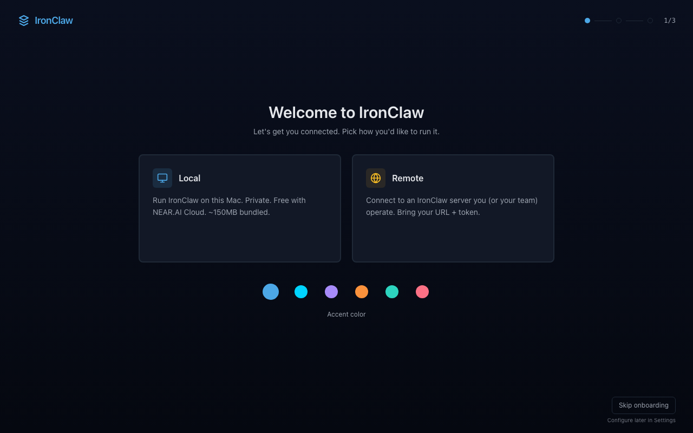
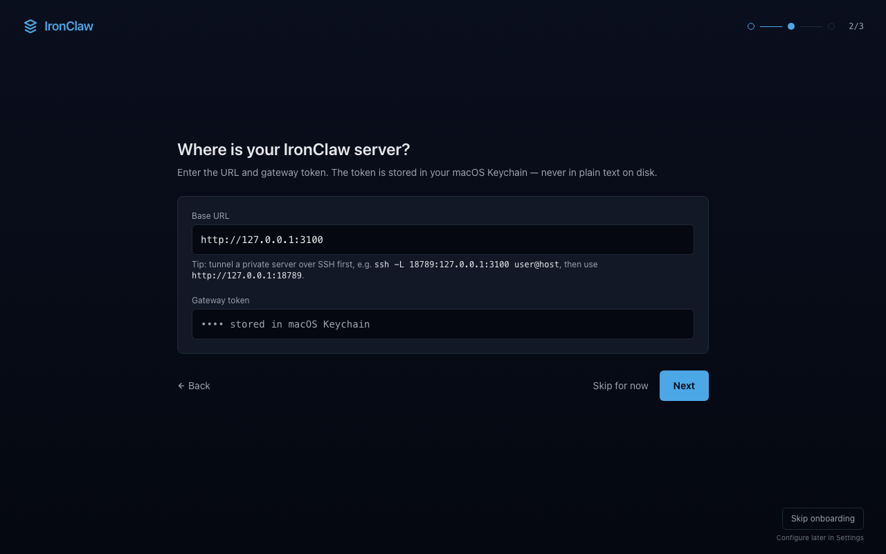
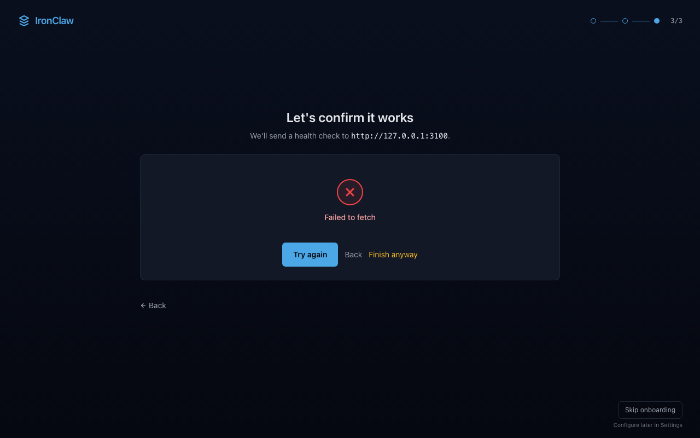
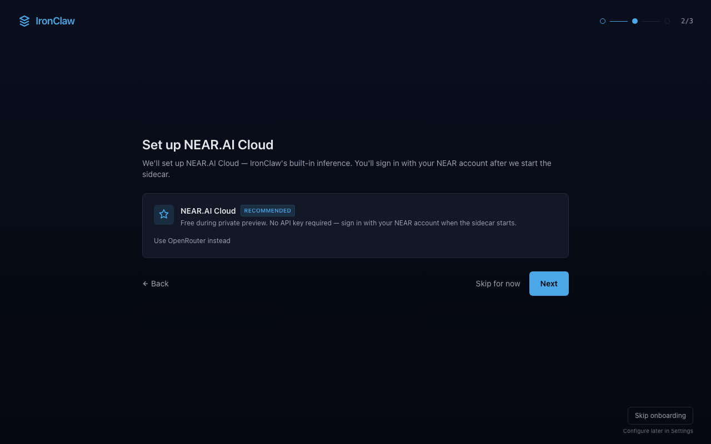

# IronClaw Desktop

[](https://github.com/abbyshekit/ironclaw-desktop/releases/latest)

A native macOS client for [IronClaw](https://github.com/nearai/ironclaw) — the Rust knowledge agent from NEAR AI. Tauri v2 + SvelteKit. Dark, fast, ~5MB binary footprint (excluding bundled sidecar).

## Download

Latest macOS DMG: https://github.com/abbyshekit/ironclaw-desktop/releases/latest

Apple Silicon and Intel both shipped. Unsigned-by-Apple (the updater signature is for in-app update verification, separate from Apple notarization which is a future TODO).

## Why

IronClaw ships with a TUI and a web UI served by its own gateway. This app gives it a polished native shell with macOS conventions: Cmd+K palette, Keychain-backed credentials, native notifications, menu-bar status, sidecar lifecycle managed for you.

## 5-minute dev bring-up

If you've cloned the repo and have a remote gateway reachable over an SSH alias:

```bash
bash scripts/dev-up.sh
```

That single command:

1. Opens the SSH tunnel to the remote gateway (idempotent, skips if already up).
2. Verifies the gateway responds.
3. Stages your bearer token into the file-fallback slot the Rust side falls back to when the macOS keychain ACL prompt hangs (see [v0.2.8 fix](CHANGELOG.md)).
4. Builds the frontend and the Rust binary, ad-hoc-signs the bundle.
5. Launches the app with `RUST_LOG=info` captured to `/tmp/ironclaw_dev.log` and surfaces the first ~10s of `ironclaw_diag` events so you can see the token load + first fetches.

Useful flags:

```bash
bash scripts/dev-up.sh --skip-build         # just re-launch the existing bundle
bash scripts/dev-up.sh --no-tunnel          # use a custom IRONCLAW_GATEWAY_URL
bash scripts/dev-up.sh --profile alt-svr    # bring up a non-default profile

IRONCLAW_TUNNEL_HOST=my-prod-box \
IRONCLAW_TUNNEL_PORT=23456 \
  bash scripts/dev-up.sh                    # point at a different remote
```

If the file-fallback ever stops feeling clean (handing the machine off, sharing the bundle, etc.), wipe it:

```bash
bash scripts/clear-token.sh default         # one profile
bash scripts/clear-token.sh --all           # nuke every file-fallback
```

For the keychain entry itself, use the `security` CLI:

```bash
security delete-generic-password \
  -s com.openclaw.ironclaw-desktop \
  -a 'gateway-token:default'
```

## Quick tour

Every surface is one chord away. Memorize these seven and you have the app:

- **Cmd+K** — command palette. Fuzzy search across navigation, threads, skills, routines, docs, and one-shot actions.
- **Cmd+Shift+F** — global search across surfaces (knowledge, skills, routines, threads).
- **Cmd+T** — quick thread switcher. Biased toward the last ten threads you opened.
- **Cmd+Shift+N** — quick capture. Drop a thought into a dedicated "Quick captures" thread without leaving the current surface.
- **Cmd+Shift+P** — workspace presets. Save and restore active path, current thread, panel widths, sidebar collapse, tray badge, status bar visibility.
- **Cmd+/** — toggle the bottom status bar (gateway / profile / sidecar state).
- **Cmd+,** — Settings (macOS convention).

Top-level routes:

| Chord | Surface                                 |
| ----- | --------------------------------------- |
| Cmd+1 | Chat                                    |
| Cmd+2 | Knowledge                               |
| Cmd+3 | Skills                                  |
| Cmd+4 | Routines                                |
| Cmd+5 | Jobs                                    |
| Cmd+6 | Logs                                    |
| Cmd+7 | Extensions                              |
| Cmd+8 | Admin _(gated on `adminMode`)_          |
| Cmd+9 | Missions _(gated on `engineV2Enabled`)_ |

The menu-bar tray gives you Show/Hide, Restart sidecar, Open Settings, Quit even when the window is hidden.

For the wiring underneath all this, see [`ARCHITECTURE.md`](ARCHITECTURE.md). For how to contribute a change, see [`CONTRIBUTING.md`](CONTRIBUTING.md).

## Workflows

The four flows below cover ~95% of how people use the app. Pick the one that matches your setup.

### 1. Connecting to a remote IronClaw

The common case: IronClaw already runs on a server you control (baremetal3, abby, a teammate's machine). The app is a thin client that talks to that gateway over HTTP.



1. **Forward the gateway port over SSH.** IronClaw binds to `127.0.0.1` on the server, so you need a tunnel. The bundled helper handles it (see [SSH tunnel helper](#ssh-tunnel-helper) below):

   ```bash
   bash scripts/tunnel.sh open       # opens default tunnel to ironclaw-nearai:18789
   ```

   Or roll your own:

   ```bash
   ssh -L 18789:127.0.0.1:3100 user@your-server
   ```

2. **Launch the app**, pick **Remote** on the welcome screen, then enter the local end of the tunnel as the Base URL and paste your gateway token.

   

   The token never touches disk in plain text — it's written to the macOS Keychain under `ironclaw-desktop:<profile-id>`. On re-launch the app reads from the Keychain, so you only paste once per profile.

3. **Step 3 runs a health check** against the URL you entered. If it fails, you'll see a "Failed to fetch" panel with **Try again** / **Finish anyway**. Pick **Finish anyway** if you know the tunnel isn't open yet — you can re-test from Settings later.

   

Once connected, Cmd+1 lands you in Chat and the bottom status bar shows the gateway URL + a green dot.

### 2. Running the bundled local sidecar

For users without a remote IronClaw. The `.app` ships a ~120MB IronClaw binary inside `Contents/Resources/binaries/` (universal — both Apple Silicon and Intel slices). The app spawns + manages it for you.

1. **Launch the app**, pick **Local** on the welcome screen.

2. **Step 2 sets the inference backend.** NEAR.AI Cloud is recommended — it's free during private preview, no API key needed. You'll OAuth into your NEAR account once the sidecar starts. OpenRouter is the advanced alternative (paste a key, picks any model on OpenRouter).

   

3. **Step 3 spawns the sidecar.** First spawn takes ~3 seconds (binary unpack, libSQL DB init). The app polls `http://127.0.0.1:<port>` until it answers, then drops you into Chat.

4. **Sign in to NEAR.AI Cloud.** IronClaw opens its web UI in your browser on first inference request — OAuth flow lives there, not in the desktop app. Once you approve, the sidecar caches the token and the desktop client keeps talking to it normally.

The sidecar PID and port are tracked by the app — quitting the app stops the sidecar cleanly. If the sidecar dies unexpectedly, the tray icon flips to "disconnected" and a notification fires (controllable in Settings → Notifications).

### 3. Switching profiles

For users with multiple IronClaw instances (e.g. work + personal, prod + staging).

- The **sidebar profile chip** at the top opens a picker. Each profile has its own connection settings, its own Keychain entry, and its own active thread/draft state.
- **Cmd+click any profile** in the picker to open it in a new window — both windows poll independently, both show separate tray status, and tokens stay scoped to the profile they were entered for.
- **New profile**: sidebar chip → "+ New profile". The dialog asks for name, mode (Local/Remote), URL, and token. Save and the new profile shows in the chip menu.

> TODO: capture sidebar profile chip screenshot once Tauri shell is running. The chip lives at the top of the left rail; the open-state dropdown shows all profiles with mode badges + last-seen indicator. [Screenshot: Sidebar profile chip open with two profiles]

### 4. Slash commands + templates

The chat composer treats `/` as a special prefix.

- `/skill-name` — invoke a bundled skill directly. Autocompletes against installed skills (the 30+ that ship + anything you've added). Hit Tab to accept; the skill runs against the current thread.
- `/template-name` — expand a saved prompt template into the composer. Templates are JSON files in the workspace, edited via Settings → Templates (or `Cmd+Shift+T`).
- **`Cmd+Shift+T`** opens the templates modal directly — search, preview, insert.

> TODO: capture slash-autocomplete and templates modal once Tauri shell is running. The slash menu pops above the composer with a fuzzy-matched list; templates modal is a centered dialog with split-pane preview. [Screenshot: Slash autocomplete dropdown]

### 5. Cross-surface global search

**`Cmd+Shift+F`** opens the global search. One input, six sources: **knowledge**, **threads**, **skills**, **routines**, **jobs**, **extensions**.

- **Filter pills** above the results let you scope to one source.
- **Number-key shortcuts** (1-6) toggle pills without leaving the keyboard.
- **Enter** jumps to the highlighted result; **Cmd+Enter** opens it in a new pane.

> TODO: capture global search with results spanning multiple surfaces once Tauri shell is running. Should show: filter pills along the top, mixed-source results grouped by type, keyboard-focus indicator on the first result. [Screenshot: Cmd+Shift+F global search]

### 6. Engine v2 (advanced)

Engine v2 is the next-generation execution surface — multi-step missions with planner, executor, and verifier roles. It's gated off by default while it bakes.

To enable: **Settings → Advanced → "Show Engine v2 surface"**. After flipping the toggle, `Cmd+9` reveals the Missions tab.

> TODO: capture Settings → Advanced panel with the Engine v2 toggle once Tauri shell is running. [Screenshot: Settings Advanced — Engine v2 toggle]

## What's inside

- **Chat** — streaming conversations with markdown rendering, code-block copy, retry on failure, draft persistence per thread
- **Knowledge** — browse the workspace doc tree, FTS search, read + write (edit existing, create new)
- **Skills** — list + filter the 30+ bundled skills, view metadata (trust, source, usage hint)
- **Routines** — view scheduled jobs, toggle on/off, trigger manually, inspect run history
- **Logs** — live-tail the gateway via SSE, filter by level + grep, virtualized for 5K+ entries
- **Extensions** — install/activate MCP servers, OAuth providers, channel integrations
- **Settings** — per-profile gateway configs, Keychain-backed tokens, local sidecar lifecycle
- **Cmd+K palette** — fuzzy-search across navigation, threads, skills, routines, docs
- **Signed auto-updater** — releases ship signed `.app.tar.gz` + `.sig` artifacts; the in-app updater verifies the signature against the pubkey baked into the binary before installing. Cadence configurable (off / launch only / launch + 1 h / launch + 6 h) under Settings → Advanced. Apple notarization (the Gatekeeper-facing signature) is a separate, pending TODO.

## Connection modes

- **Remote** — point the app at any IronClaw gateway (Caddy-fronted prod, SSH tunnel, etc.)
- **Local** — spawn the bundled IronClaw binary as a sidecar. NEAR.AI Cloud by default (no API key needed, OAuth handled by IronClaw). OpenRouter available as an advanced backend.

## Prerequisites

- macOS 12+ (Apple Silicon or Intel)
- Node 22+
- Rust 1.80+
- Xcode Command Line Tools: `xcode-select --install`

## Develop

```bash
npm install
npm run tauri dev
```

First compile takes ~3 min (pulls Tauri, plugin-shell, plugin-updater, plugin-notification, keyring, uuid). Subsequent runs are cached.

Logging is wired through `env_logger`. The default filter is `ironclaw_desktop_lib=info,warn` — info-level for our crate, warn for everything else. Override at runtime with `RUST_LOG`:

```bash
RUST_LOG=debug npm run tauri dev                          # verbose everywhere
RUST_LOG=ironclaw_desktop_lib=trace,tauri=debug npm run tauri dev   # finer-grained
```

Targets used in our code: `ironclaw_tray`, `ironclaw_sidecar`, `ironclaw_keychain`. The keychain target logs slot names only — never the underlying secret.

## Pre-commit hooks

`simple-git-hooks` runs `prettier --check` on changed files before commit (via `lint-staged` — see the `lint-staged` block in `package.json`). Pre-push runs the full `npm run check` + `npm run test` suite, which mirrors what CI runs in `.github/workflows/check.yml`.

Hooks auto-install on fresh clones: `npm install` triggers the `prepare` script, which runs `simple-git-hooks` and wires `.git/hooks/pre-commit` and `.git/hooks/pre-push`.

To bypass a hook in a one-off (don't make a habit of this), prefix with `SKIP_SIMPLE_GIT_HOOKS=1`. For Rust formatting, run `cargo fmt --manifest-path src-tauri/Cargo.toml` manually — it's deliberately not in the JS hook to keep toolchains separate.

The codebase has NOT been mass-formatted; prettier only touches files as you change them. Don't run `npx prettier --write .` unless you intend a separate, isolated reformat commit.

## Build

```bash
# Unsigned .app + .dmg for Apple Silicon
npm run tauri build

# Output: src-tauri/target/release/bundle/{macos,dmg}/
```

## Static checks

```bash
npm run check    # svelte-check + TypeScript
npm run build    # vite frontend build (no Tauri compile)
cargo check --manifest-path src-tauri/Cargo.toml
```

### Accessibility

`tests/e2e/a11y.spec.ts` is an automated axe-core sweep that visits every
top-level surface (`/`, `/knowledge`, `/skills`, `/routines`, `/jobs`,
`/logs`, `/extensions`, `/admin`, `/settings`, `/missions`) and asserts
the route has no critical/serious axe violations. Runs in CI on every PR
via `.github/workflows/e2e.yml` and locally via:

```bash
npm run test:e2e -- a11y.spec.ts
```

How to read the output:

- **Critical / serious** violations fail the build. If the spec reports
  one, the assertion message includes the offending element's selector
  and HTML snippet so you can locate it without re-running locally.
- **Moderate / minor** violations are logged with a
  `[a11y][<route>]` prefix but don't fail. Grep CI logs for that prefix
  to see the per-route count. Most of these are
  `aria-labelledby` / `aria-describedby` references that resolve at
  runtime but axe can't dereference in the headless DOM (the referenced
  element is in a portaled overlay that mounts on hover/focus).
- **`color-contrast`** is excluded from the suite. Manual review confirmed
  the navy/cyan/gold brand tokens meet WCAG AA; axe routinely false-flags
  tailwind opacity utilities because it can't model the underlying opaque
  background. See the spec header comment for the full rationale.

When adding a new route, append it to the `ROUTES` array in the spec and
extend the surface mock in `tests/e2e/_helpers.ts` (`mockGatewaySurfaces`)
with any new list/summary endpoints the route reads on mount.

## Local sidecar binaries

The bundled IronClaw binaries are downloaded out-of-band (they're large and gitignored):

```bash
bash src-tauri/binaries/download.sh
```

This fetches both `aarch64-apple-darwin` and `x86_64-apple-darwin` from the official IronClaw release.

## Project layout

```
ironclaw-desktop/
├── src/                         # SvelteKit frontend (Svelte 5 runes + TS)
│   ├── routes/                  # one folder per surface
│   └── lib/
│       ├── api/ironclaw.ts      # typed HTTP client
│       ├── stores/              # rune singletons (settings, connection, threads, ...)
│       └── components/          # shared (Toasts, MarkdownView, UpdaterBanner, ...)
├── src-tauri/                   # Rust backend
│   ├── src/
│   │   ├── lib.rs               # Tauri commands + plugin registration
│   │   ├── sidecar.rs           # spawn/stop bundled IronClaw
│   │   ├── keychain.rs          # macOS Keychain wrappers
│   │   └── settings.rs          # JSON settings persistence
│   ├── binaries/                # bundled IronClaw sidecar (gitignored)
│   ├── icons/                   # generated from icons/iconsrc.svg via build_icons.py
│   └── tauri.conf.json
└── .github/workflows/           # CI + release pipeline
```

## Releasing

### One-time setup (signing keypair)

1. Generate the updater signing key:

   ```bash
   bash scripts/generate-updater-key.sh
   ```

   The script writes the keypair to `~/.tauri/ironclaw-updater.key{,.pub}` and refuses to overwrite an existing key.

2. Paste the printed public key into `src-tauri/tauri.conf.json` under `plugins.updater.pubkey`. Commit that change.

3. In the GitHub repo settings, add two Actions secrets:
   - `TAURI_SIGNING_PRIVATE_KEY` — contents of `~/.tauri/ironclaw-updater.key` (already base64-encoded by Tauri). Copy with `cat ~/.tauri/ironclaw-updater.key | pbcopy`.
   - `TAURI_SIGNING_PRIVATE_KEY_PASSWORD` — empty by default (the generator uses no password). If you re-run the generator with a password later, update this secret.

Until the pubkey is committed and both secrets are set, the workflow builds **unsigned** updater artifacts. Builds still succeed; auto-update verification will fail until signing is wired.

### Cutting a release

1. Bump the version across all three files at once:

   ```bash
   bash scripts/bump-version.sh 0.1.3
   ```

   This updates `package.json`, `src-tauri/tauri.conf.json`, and `src-tauri/Cargo.toml`. All three must agree.

2. Update `CHANGELOG.md` with what changed.

3. Commit + tag:

   ```bash
   git commit -am "v0.1.3"
   git tag v0.1.3
   git push && git push --tags
   ```

4. The `release` workflow (`.github/workflows/release.yml`) builds both arches (`aarch64-apple-darwin` and `x86_64-apple-darwin`), signs the updater artifacts when secrets are present, and creates a GitHub release with the `.dmg`, `.app.tar.gz`, and `.app.tar.gz.sig` files attached.

5. Tauri auto-generates the `latest.json` updater manifest and attaches it to the release. The app polls `https://github.com/abbyshekit/ironclaw-desktop/releases/latest/download/latest.json` on startup.

### Sanity-checking a release locally before tagging

```bash
npm run tauri build
```

Produces unsigned `.app` + `.dmg` at `src-tauri/target/release/bundle/`. Mount the DMG, drag to Applications, right-click → Open (first launch only — Gatekeeper warns about unsigned apps).

### SSH tunnel helper

If your IronClaw runs on a remote host, the desktop client needs the
gateway port forwarded locally. The bundled helper handles open/close/
status for you:

```
bash scripts/tunnel.sh open       # opens default tunnel to ironclaw-nearai:18789
bash scripts/tunnel.sh status     # reports state + gateway health
bash scripts/tunnel.sh close      # kills the tunnel
bash scripts/tunnel.sh restart    # close + open
```

Override defaults via env: `IRONCLAW_SSH_ALIAS` + `IRONCLAW_TUNNEL_PORT`.

### Probing server-blocked endpoints

Our client has stubbed methods for endpoints the gateway doesn't yet expose
(thread delete, routine create, memory delete, etc.). To check whether any
have landed upstream:

```bash
bash scripts/probe-blocked-endpoints.sh
```

Yellow ⚠ lines indicate the gateway started responding — time to wire UI.
The script reads SSH alias `ironclaw-nearai` and resolves the gateway token
from the live IronClaw process env. Always exits 0 (it's a discovery tool,
not a CI gate).

## Bundle analysis

The static-adapter output lives at `build/_app/immutable/` after `npm run
build`. Four scripts under `scripts/` give you a zero-dep view of what
shipped:

```bash
# Walk the build, report per-file raw + gzip size, line count, top-5 largest.
# Writes /tmp/ironclaw-bundle-report.txt. Auto-runs `npm run build` if
# build/ is missing (force a rebuild with FORCE_BUILD=1).
bash scripts/analyze-bundle.sh

# Diff the current build against scripts/bundle-baseline.json. Exits 3 if
# total gzip grew >10% or any stable-path file grew >25%. Accept the new
# sizes with UPDATE_BASELINE=1.
bash scripts/bundle-compare.sh

# Spin up `npm run dev` (Vite on :1420), probe a handful of routes for TTFB
# + total transfer time, count critical resources, kill the server. Writes
# /tmp/ironclaw-perf-snapshot.txt. Smoke test only — not Lighthouse.
bash scripts/perf-snapshot.sh
```

`scripts/bundle-baseline.json` is the committed reference for
`bundle-compare.sh`. Refresh it intentionally after a release lands a real
size change:

```bash
UPDATE_BASELINE=1 bash scripts/bundle-compare.sh
```

TODO: wire `bundle-compare.sh` into the PR workflow under
`.github/workflows/` so each PR posts a bundle diff comment against
`main`'s baseline. For v1 the scripts are local-only.

### Bundle size budget (CI-enforced)

`scripts/check-bundle-size.sh` enforces hard ceilings on the gzipped JS
shipped to users. It sums `build/_app/immutable/{entry,chunks,nodes}/*.js`
(CSS/fonts/images excluded — those rarely cause regressions) and compares
against `scripts/bundle-budget.json`:

```json
{
  "total_gzip_kb": 360,
  "entry_gzip_kb": 6,
  "largest_chunk_gzip_kb": 55
}
```

Exit codes: `0` under budget, `1` over (fails CI), `2` within 90% of budget
(warning — CI treats this as a soft signal, not a block). The check runs on
every PR via `.github/workflows/check.yml` after `npm run build`.

To run locally:

```bash
bash scripts/check-bundle-size.sh             # builds first, then checks
SKIP_BUILD=1 bash scripts/check-bundle-size.sh   # use existing build/
```

**Bumping the budget intentionally.** When a feature legitimately needs the
size (new vendor dep, new route bundle, etc.) and the bump survives a
`bundle-compare.sh` sanity check, edit `scripts/bundle-budget.json` in the
same PR that adds the dep. Convention: leave ~10% headroom above the new
actuals so the next minor change doesn't immediately re-trip the gate. Keep
the bump justified in the commit message so future reviewers can sanity-check
the trade-off (a fat dep that landed for one feature is the kind of thing
that should get noticed twice).

If a bump is _not_ intentional — i.e. the check failed on your PR and you
weren't expecting it — run `bash scripts/bundle-compare.sh` to see which
files grew and decide whether the regression is fixable (lazy-load, tree-
shake, drop the import) before raising the budget.

## Troubleshooting

| Symptom                                                                            | Fix                                                                                                                                                                                                                                                                                                                                 |
| ---------------------------------------------------------------------------------- | ----------------------------------------------------------------------------------------------------------------------------------------------------------------------------------------------------------------------------------------------------------------------------------------------------------------------------------- |
| Status bar shows **Disconnected** even though the server is up                     | Check the SSH tunnel is still alive (`bash scripts/tunnel.sh status`). If the gateway port shifted, re-enter the URL under **Settings → Profile → Base URL**. Re-paste the token under **Settings → Profile → Gateway token** to refresh the Keychain entry.                                                                        |
| macOS warns **"App can't be opened because it is from an unidentified developer"** | The DMG is unsigned. Right-click the `.app` in Finder → **Open** → confirm in the dialog. macOS remembers the exception per binary, so subsequent launches work normally. Or strip the quarantine attribute: `xattr -d com.apple.quarantine /Applications/IronClaw.app`.                                                            |
| Local sidecar fails to spawn on launch                                             | Most often a NEAR.AI Cloud sign-in problem — open the IronClaw web UI (button in **Settings → Local sidecar**) and re-authenticate. If you're on the OpenRouter backend, check the OpenRouter key is set under **Settings → Profile → LLM backend**. Logs live at `~/Library/Application Support/com.ironclaw.desktop/sidecar.log`. |
| Tray icon missing from the menu bar                                                | **Settings → Advanced → "Show in menu bar"**. The toggle is on by default; if it ever flips off it usually means a startup crash before tray init. Restart the app, then re-toggle.                                                                                                                                                 |
| **Cmd+K** (or any other chord) doesn't open the palette                            | The shortcut only fires when the app window has focus. Cmd+Tab into IronClaw first, then try again. The tray "Show window" item brings it forward even when hidden.                                                                                                                                                                 |
| Sidecar dies repeatedly with "port already in use"                                 | Another IronClaw process is bound to the local port. Open Activity Monitor, kill stray `ironclaw` processes, then **Settings → Local sidecar → Restart**. If the conflict is with a different service, change the local port in **Settings → Local sidecar → Port**.                                                                |
| Updater banner says "signature verification failed"                                | Means the release wasn't signed with the pubkey wired into your build. Either update to a release built after signing landed, or download the new DMG manually from the GitHub Releases page.                                                                                                                                       |

For anything not covered here, capture the full log with `RUST_LOG=debug npm run tauri dev` (see [Develop](#develop)) and open an issue with the trace.

## License

MIT — see [LICENSE](LICENSE).
